# ProbabilityConceptVisualizer

**ProbabilityConceptVisualizer** is an R package designed to help students and educators explore key concepts in probability and statistics. This package includes interactive Shiny apps that make learning these topics more engaging and easier to understand through visualizations and simulations.

## Key Features

- **Interactive Learning**: Provides hands-on experiences with apps that let users change parameters and see results immediately.

- **Wide Range of Topics**: Covers important probability topics like the Birthday Paradox, probability trees, Markov Chains, and experiments such as coin tosses and dice rolls. It also includes statistics concepts like the Central Limit Theorem and the Weak Law of Large Numbers.

- **Educational Design**: Created with students and educators in mind, offering clear instructions and examples to support teaching and learning.

- **User-Friendly Interface**: Each app is easy to use, making it accessible for everyone, from beginners to those with more experience.

## Target Audience

This package is perfect for:

- **Students**: Those starting out in probability and statistics who will benefit from interactive and visual learning tools.

- **Educators**: Teachers and professors looking for effective ways to explain statistical and probability concepts in the classroom.

## Applications

- **Classroom Use**: A great addition to probability and statistics courses, providing interactive tools to complement traditional teaching.

- **Workshops and Training**: Enhance learning experiences in workshops with dynamic visual tools.

- **Self-Study**: Allows students to explore and understand concepts on their own through interactive learning.

---

With this understanding of the package, you can proceed to install and explore the various applications it offers.


## Installation

You can install the **ProbabilityConceptVisualizer** package directly from CRAN (once published):

```r
install.packages("ProbabilityConceptVisualizer")
```

Alternatively, to install the development version from GitHub:

```r
# Install devtools if not already installed
install.packages("devtools")

# Install the package from GitHub
devtools::install_github("iitgoa-ml/probstats")
```

### Dependencies

The package requires the following R packages, which will be automatically installed if not already available:
- `DT`
- `dplyr`
- `ggplot2`
- `gridExtra`
- `palmerpenguins`
- `plotly`
- `readxl`
- `shiny`
- `zoo`
- `igraph`
- `shinyMatrix`

If necessary, you can install these dependencies manually:

```r
install.packages(c("DT", "dplyr", "ggplot2", "gridExtra", "palmerpenguins", "plotly", "readxl", "shiny", "zoo", "igraph", "shinyMatrix"))
```

---

## Usage

Once the package is installed, you can load it in R:

```r
library(ProbabilityConceptVisualizer)
```

To run a specific Shiny app, use one of the following functions:

- [`run_descriptive_analysis_app()`](#descriptive-analysis-app)
- [`run_two_experiments_app()`](#two-experiments-visualization-app)
- [`run_three_experiments_app()`](#three-experiments-visualization-app)
- [`run_birthday_paradox_app()`](#birthday-paradox-and-repeated-outcomes-visualizer-app)
- [`run_clt_wlln_app()`](#central-limit-theorem-and-weak-law-of-large-numbers-app)
- [`run_distribution_visualizer_app()`](#probability-distributions-visualizer)
- [`run_probability_tree_app()`](#probability-tree-visualization-app)
- [`run_markov_chain_visualizer()`](#markov-chain-weather-state-visualizer)


**Note:** An active internet connection is required to display equations correctly, as the package uses MathJax for rendering LaTeX in the browser.

---

## Apps Overview

Below is detailed documentation for each app. 

---

### Descriptive Analysis App

This Shiny app allows users to explore datasets by generating descriptive statistics and visualizations. It supports built-in datasets (`iris` and `palmerpenguins`) and user-uploaded Excel files.

#### Key Features
- Upload Excel files to analyze custom datasets.
- Use built-in datasets like `iris` or `palmerpenguins`.
- Generate histograms, boxplots, and scatter plots.
- Calculate and display correlation coefficients for scatter plots.
- Filter plots by variables or categories.

#### How to Use

1. Launch the app:
   ```r
   library(ProbabilityConceptVisualizer)
   run_descriptive_analysis_app()
   ```
2. Upload an Excel file (optional) or choose a built-in dataset.
3. Select the type of plot from the sidebar: Histogram, Boxplot, or Scatter Plot.
4. Adjust settings like variable selection, number of bins (for histograms), or fill options.

#### User Interface
- **Dataset Selection**: 
  - Upload Excel files or select built-in datasets.
  - Add or remove sheets dynamically.
- **Plot Options**: 
  - Choose plot types and customize with inputs specific to each plot.
  - Configure fill variables to group data in plots.

#### Example Visualizations

**Histogram Example**:  
_Histogram of a numeric variable from the selected dataset._  

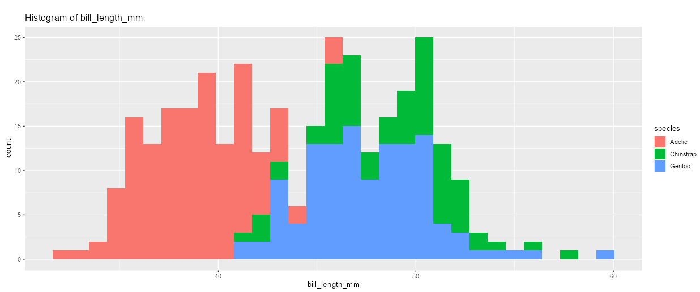

**Scatter Plot Example**:  
_Scatter plot showing relationships between two numeric variables, including correlation._  

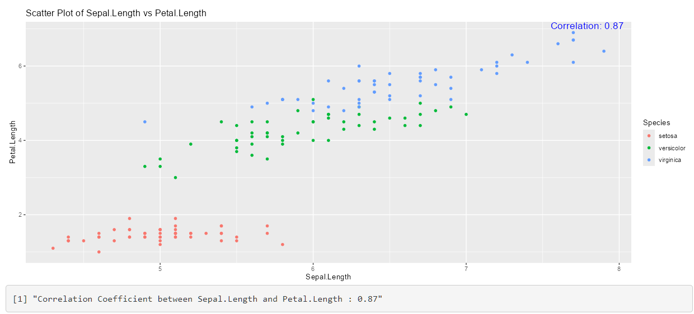


---


---

### Two Experiments Visualization App

This Shiny app allows users to explore the outcomes of two experiments (such as a coin toss or dice roll) and visualize the probabilities and outcomes interactively.

#### Key Features
- Select between "Coin Toss" or "Dice Roll" for the two experiments.
- Choose specific outcomes for each event or explore using interactive mode.
- Visualize the results and probabilities on a 2D grid.

#### How to Use

1. Launch the app:
   ```r
   library(ProbabilityConceptVisualizer)
   run_two_experiments_app()
   ```
2. Select the type of each experiment (either Coin Toss or Dice Roll).
3. Choose the outcomes for each experiment.
4. Visualize the probability and outcomes on a 2D plot.
5. Optionally, use the interactive mode to click on the grid and select outcomes.

#### User Interface
- **Experiment Selection**: Choose between "Coin Toss" or "Dice Roll" for each experiment.
- **Outcome Selection**: Select outcomes for each event (e.g., "Head" or "Tail" for Coin Toss, or values from 1 to 6 for Dice Roll).
- **Interactive Mode**: In this mode, users can click on the 2D plot to select outcomes, which are highlighted.

#### Example Visualizations

**Outcome Visualization**:  
_Interactive 2D plot showing the outcomes of two experiments (coin toss or dice roll)._  

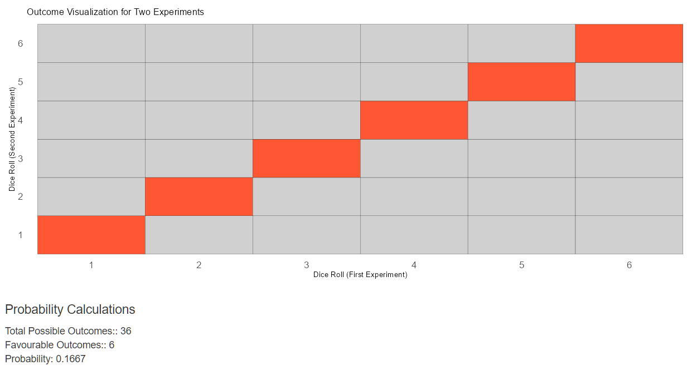


---


---

### Three Experiments Visualization App

This Shiny app visualizes the outcomes of three experiments: Coin Toss or Dice Roll. Users can select different experiment types and outcomes, and visualize the probability of selected outcomes in a 3D scatter plot.

#### Key Features
- Select between "Coin Toss" or "Dice Roll" for three different experiments.
- Choose specific outcomes for each event.
- Visualize the probability of selected outcomes in a 3D scatter plot.
- Display statistics for favorable outcomes, total outcomes, and event probability.

#### How to Use

1. Launch the app:
   ```r
   library(ProbabilityConceptVisualizer)
   run_three_experiments_app()  # Run the Shiny app
   ```
2. Select the type of experiment for each of the three events (Coin Toss or Dice Roll).
3. Choose the specific outcomes you want to observe for each experiment.
4. Press the "Refresh Visualization" button to update the plot and statistics.
5. View the 3D scatter plot of possible outcomes and the calculated statistics.

#### User Interface
- **Input Parameters**:
  - Select event types for the three experiments (Coin Toss or Dice Roll).
  - Choose specific outcomes for each event (e.g., Heads or Tails for Coin Toss, or numbers 1 to 6 for Dice Roll).
- **Visualizations**:
  - **3D Scatter Plot**: Displays the possible outcomes for all three events, with selected outcomes highlighted.
- **Event Statistics**:
  - **Favorable Outcomes**: Number of outcomes that match your criteria.
  - **Total Outcomes**: Total possible outcomes based on selected event types.
  - **Probability of Event**: Probability of the event (favorable outcomes / total outcomes).

#### Example Visualizations

**3D Scatter Plot**:  
_A 3D plot showing the possible outcomes of the three events, with selected outcomes highlighted._  

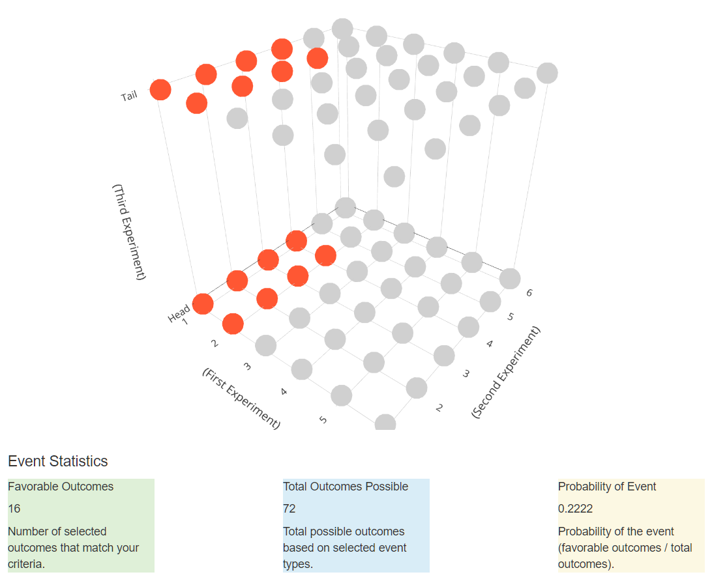


#### Mathematical Formulas

The probability is calculated based on the selected outcomes for each event:

- **Favorable Outcomes**: The number of outcomes that match the user’s selected outcomes.
- **Total Outcomes**: The total number of possible outcomes for the three experiments, determined by the product of the number of choices for each experiment.
- **Event Probability**:
  $$ P(\text{Event}) = \frac{\text{Number of Favorable Outcomes}}{\text{Total Number of Outcomes}} $$

---

---

### Central Limit Theorem and Weak Law of Large Numbers App

This Shiny app allows users to explore two important statistical concepts: the **Central Limit Theorem (CLT)** and the **Weak Law of Large Numbers (LLN)**.

#### Key Features
- Visualize the Central Limit Theorem by generating sample means from various distributions.
- Explore the Weak Law of Large Numbers by observing convergence of sample averages.
- Interactive controls for choosing distribution types, adjusting parameters, and toggling visualization options.

#### How to Use

1. Launch the app:
   ```r
   library(ProbabilityConceptVisualizer)
   run_clt_wlln_app()
   ```
2. Choose a mode (CLT or WLLN) from the dropdown menu.
3. Adjust the settings in the sidebar to customize the visualizations.

#### User Interface
- **CLT Mode**: 
  - Select distribution type: Uniform, Exponential, or Binomial.
  - Adjust parameters like `min` and `max` for Uniform, `rate` for Exponential, or `size` and `prob` for Binomial.
  - Modify sliders for sample size, number of samples, and histogram bins.
  - Toggle theoretical normal curve display.

- **WLLN Mode**: 
  - Choose an experiment type: Coin Flip, Dice Roll, or Beta Distribution.
  - Adjust number of trials and rolling average window.
  - Optionally, overlay the theoretical mean on the plot.

#### Example Visualizations

**Central Limit Theorem Mode**:  
_Visualization of sample means forming a normal distribution._  

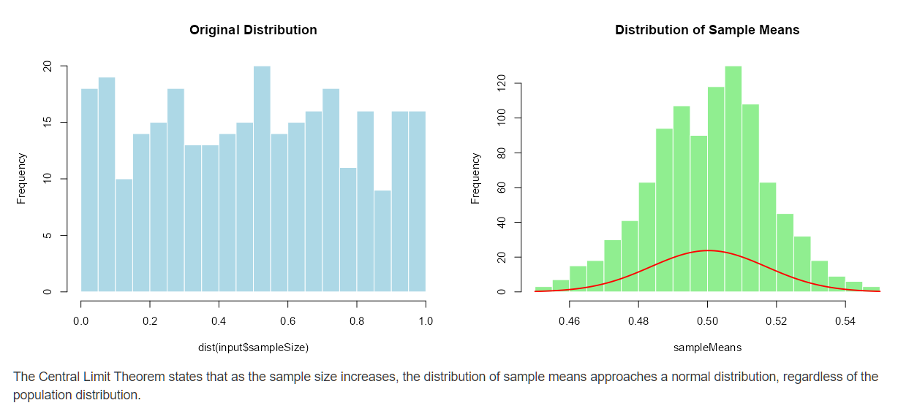


**Weak Law of Large Numbers Mode**:  
_Observation of sample averages converging to the expected value._  

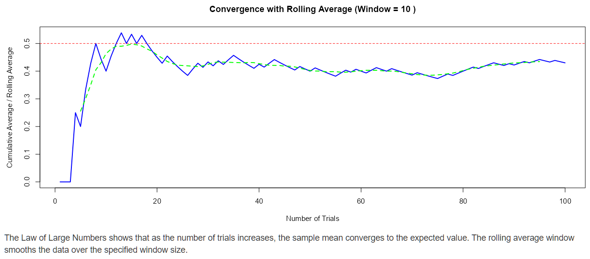


---


---

### Markov Chain Weather State Visualizer

This Shiny app simulates weather transitions using a Markov Chain model. It allows users to define a transition matrix, set initial probabilities, and observe the evolution of state probabilities over time through interactive visualizations.

#### Key Features
- Validate the transition matrix and initial state probabilities.
- Simulate and visualize the evolution of state probabilities over a defined number of steps.
- Analyze steady-state probabilities using eigenvalues or linear equations.
- View dynamic representations such as state transition diagrams, probability plots, and pie charts.

#### How to Use

1. Launch the app:
   ```r
   library(ProbabilityConceptVisualizer)
   run_markov_chain_visualizer()
   ```
2. Define the transition matrix. Each row represents the probabilities of transitioning from one state to others.
3. Set the initial probabilities for states: Sunny, Cloudy, and Rainy.
4. Specify the number of simulation steps and click "Run Simulation."
5. Observe results via visualizations such as:
   - **State Transition Diagram**: Shows transitions between states with probabilities.
   - **Probability Evolution Plot**: Displays state probabilities over time.
   - **Initial and Final State Pie Charts**: Illustrate the distribution of probabilities at the first and final steps.

#### User Interface
- **Input Parameters**:
  - Transition matrix: Define probabilities for transitioning between states.
  - Initial state probabilities: Specify the likelihood of starting in each state.
  - Number of steps: Set the number of iterations for the simulation.
- **Visualizations**:
  - Probability evolution plot: Line graph tracking probabilities over time.
  - State transition diagram: Graphical representation of transitions and weights.
  - Pie charts: Compare initial and final state distributions.

#### Example Visualizations

**State Transition Diagram**:  
_Visual representation of transitions between weather states._  

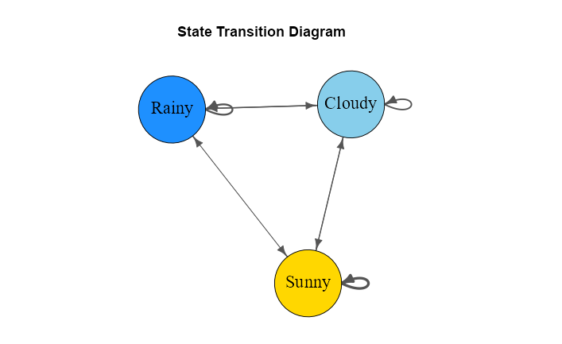
*(Placeholder for image: Replace with a diagram showing transitions like Sunny → Cloudy with weighted edges.)*

**Probability Evolution Plot**:  
_Line graph showing the probability of Sunny, Cloudy, and Rainy states over time._  

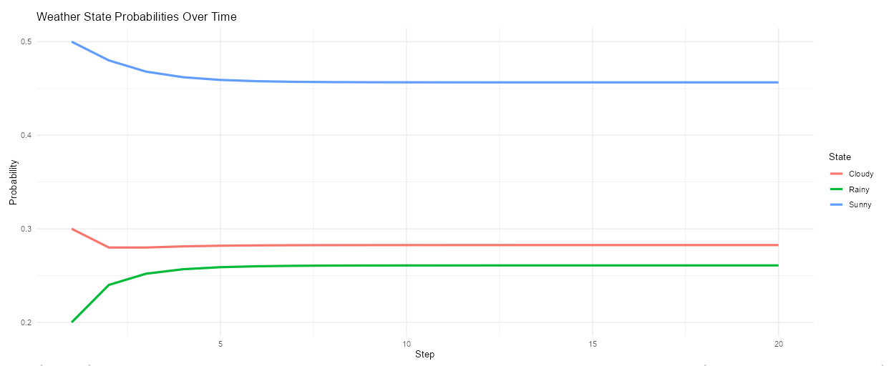


**Initial and Final State Pie Charts**:  
_Compare the probability distributions at the initial and final steps._  

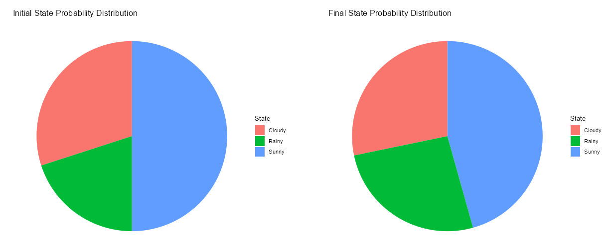


#### Additional Analysis
- **Steady-State Probabilities**: The app computes steady-state probabilities using:
  - Eigenvalue decomposition.
  - Linear equation solving.
- **Dynamic Relationships**:
  - Users can observe how the initial probabilities interact with the transition matrix to yield probabilities at later steps.
  - Detailed mathematical relationships are rendered using MathJax.

---

---

### Birthday Paradox and Repeated Outcomes Visualizer App

This Shiny app is designed to help users intuitively explore the fascinating and counterintuitive probability of shared birthdays in the **Birthday Paradox**. Users can visualize how the probability changes with group size and compare this phenomenon with repeated outcomes in other random events like dice rolls, card draws, and coin flips.

#### Key Features
- **Explore the Birthday Paradox**: Understand why shared birthdays are more likely than expected in groups of 23 or more people.
- Compare with other events: Build intuition by exploring probabilities of repeated outcomes in dice rolls, card draws, and coin flips.
- Simulate outcomes: Visualize how repeated events occur across multiple iterations.
- Interactive visualizations: Adjust group size and number of simulations to see their impact on probabilities.

#### How to Use

1. Launch the app:
   `r 
   library(ProbabilityConceptVisualizer)
   run_birthday_paradox_app()  # Launch the app
   `
2. Select an event type (default is the **Birthday Paradox**).
3. Adjust parameters like group size (`n`) or number of iterations for simulations.
4. Visualize the probability of a repeated outcome (e.g., shared birthday or repeated dice roll).
5. Run multiple simulations to analyze the distribution of repeated outcomes.

#### User Interface
- **Input Parameters**:
  - Event type: Start with "Birthday Paradox" or explore "Dice Rolls", "Card Draws", and "Coin Flips" for comparison.
  - Group size (`n`): Set the number of people (or samples) to observe repeated outcomes.
  - Number of repeated runs: Specify the number of simulations to analyze repeated events.
- **Visualizations**:
  - **Probability Curve**: A line graph showing how the likelihood of repeated outcomes changes as group size increases.
  - **Simulation Plot**: A histogram displaying the frequency of repeated outcomes across multiple simulation runs.
  - **Probability Meter**: A visual gauge showing the probability of observing a repeated outcome for the selected parameters.

#### Example Visualizations

**Birthday Paradox Probability Curve**:  
_Illustrates how the probability of shared birthdays increases sharply with group size._  

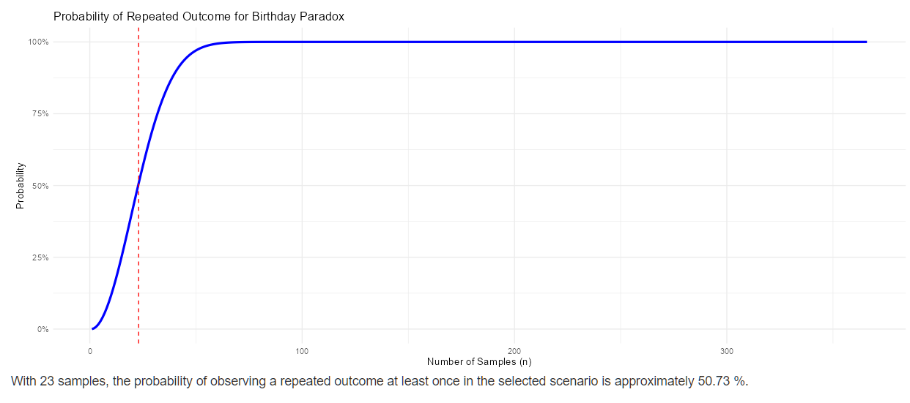

**Simulation Histogram**:  
_Shows the frequency of repeated birthdays (or other outcomes) across multiple simulation runs._  

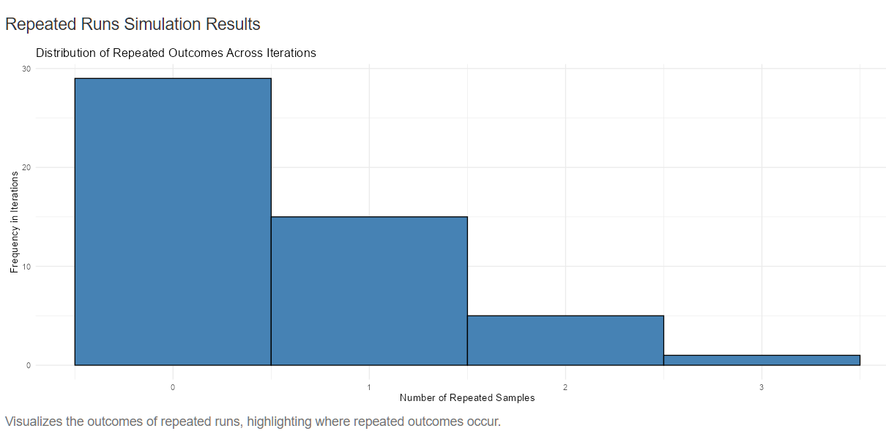

#### Mathematical Formulas

For each event type, the app dynamically displays the probability equation:

1. **Birthday Paradox**:  
   $$P(A') = 1 \times \frac{364}{365} \times \frac{363}{365} \times \cdots \times \frac{365 - n + 1}{365}$$

2. **Dice Rolls**:  
   $$P(A') = 1 \times \frac{5}{6} \times \frac{4}{6} \times \cdots \times \frac{6 - n + 1}{6}$$

3. **Card Draws**:  
   $$P(A') = 1 \times \frac{51}{52} \times \frac{50}{52} \times \cdots \times \frac{52 - n + 1}{52}$$

4. **Coin Flips**:  
   $$P(A') = 1 \times \frac{1}{2} \times \cdots \times \frac{2 - n + 1}{2}$$

#### Additional Analysis
- **Simulations**: Users can run multiple simulations to observe how repeated outcomes vary with different numbers of samples and iterations.
- **Dynamic Visualizations**: As the user adjusts parameters, the app updates the visualizations and equations to reflect the changes in real-time.

---

---

### Probability Tree Visualization App

This Shiny app visualizes a probability tree to help understand disease prevalence, test sensitivity, and test specificity. The app calculates and displays probabilities related to the likelihood of disease and test results, using both a "Disease First" and "Test First" approach.

#### Key Features
- Visualize the probability tree for disease prevalence and test outcomes.
- Adjust the prevalence, sensitivity, and specificity to see how they affect the probabilities.
- Recalculate probabilities and view the updated probability tree diagrams.

#### How to Use

1. Launch the app:
   ```r
   library(ProbabilityConceptVisualizer)
   run_probability_tree_app()  # Launch the app
   ```
2. Adjust the values for prevalence (`P(D)`), sensitivity (`P(T | D)`), and specificity (`P(~T | ~D)`).
3. Press the "Recalculate" button to update the probability tree diagrams.
4. View the visualizations for the disease-first and test-first probability trees.

#### User Interface
- **Input Parameters**:
  - Prevalence (`P(D)`): The probability of having the disease.
  - Sensitivity (`P(T | D)`): The probability of a positive test result given that the person has the disease.
  - Specificity (`P(~T | ~D)`): The probability of a negative test result given that the person does not have the disease.
- **Visualizations**:
  - **Disease First Probability Tree**: Shows the probability of test results starting with the disease state.
  - **Test First Probability Tree**: Shows the probability of disease given the test result.

#### Example Visualizations

**Disease First Probability Tree**:  
_Visual representation of the probability tree for disease prevalence first, showing outcomes based on test results._  

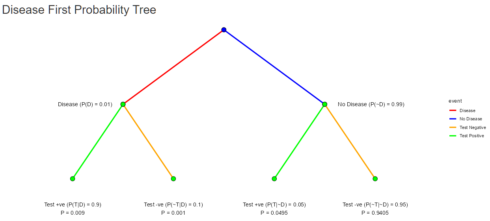


**Test First Probability Tree**:  
_Visual representation of the probability tree for test results first, showing the likelihood of disease given the test outcome._  

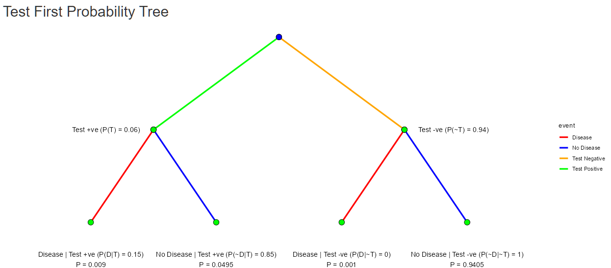


#### Mathematical Formulas

The app uses the following formulas for probability calculations:

1. **Disease First Probability Tree**:
   - Total Probability for Disease and Test:
     $$ P(D \cap T) = P(T|D) \times P(D) $$
   - Total Probability for No Disease and Test:
     $$ P(\neg D \cap T) = P(T|\neg D) \times P(\neg D) $$

2. **Test First Probability Tree**:
   - Total Probability of a Positive Test:
     $$ P(T) = P(T|D) \times P(D) + P(T|\neg D) \times P(\neg D) $$

   - Probability of Disease Given a Positive Test (Bayes' Theorem):
     $$ P(D|T) = \frac{P(T|D) \times P(D)}{P(T)} $$

---


---

### Probability Distributions Visualizer

This Shiny app provides an interactive platform to explore probabilities under various statistical distributions, including Uniform, Normal, Exponential, Binomial, and Geometric. Users can input parameters, calculate probabilities, and visualize results dynamically.

#### Key Features
- Interactive visualizations of probabilities for various distributions.
- Supports multiple variables and highlights user-defined intervals as an approach to understanding distributions.
- Simulations to validate and compare theoretical probabilities with empirical results.
- Dynamic updates to visualizations based on user-defined inputs.

#### How to Use

1. Launch the app:
   ```r
   library(ProbabilityConceptVisualizer)
   run_distribution_visualizer_app()
   ```
2. Choose a probability distribution:
   - Uniform
   - Normal
   - Exponential
   - Binomial
   - Geometric
3. Configure distribution-specific parameters, such as:
   - Mean and standard deviation (Normal distribution).
   - Rate parameter (Exponential distribution).
   - Probability of success and trials (Binomial distribution).
   - Range for Uniform distribution.
4. Specify intervals for analysis as an approach to understanding probabilities.
5. Explore dynamic visualizations:
   - Probability density or mass functions.
   - Cumulative distribution functions (CDF).
   - Highlighted probabilities based on user-defined intervals.

#### User Interface
- **Input Parameters**:
  - **Distribution type**: Choose one of the supported distributions.
  - **Parameters**: Adjust relevant parameters based on the selected distribution.
  - **Number of simulations**: Specify the number of runs for empirical analysis.

- **Visualizations**:
  - **Probability Density/Mass Function (PDF/PMF)**: Visualize the theoretical distribution with highlighted intervals.
  - **Cumulative Distribution Function (CDF)**: Compare theoretical and simulated cumulative probabilities.
  - **Simulation Histograms**: Visualize empirical distributions and validate against theoretical probabilities.

---

### Inputs and Outputs for Each Distribution

#### 1. **Uniform Distribution**
   - **Inputs**:
     - **Min**: Minimum value of the uniform distribution.
     - **Max**: Maximum value of the uniform distribution.
     - **Number of simulations**: How many samples to generate for empirical results.
     - **Interval**: The range for calculating probabilities, specified by the user (e.g., to calculate the probability of being within a certain range).
   
   - **Outputs**:
     - **Probability Density Function (PDF)**: Displays the constant density across the uniform range.
     - **Cumulative Distribution Function (CDF)**: Displays the cumulative probability up to a given value.
     - **Highlighted Interval**: The portion of the distribution specified by the user for analysis.
     - **Simulation Histogram**: Compares the theoretical uniform distribution with a histogram from simulated data.
  
   **Visualization**:  
   _Probability density function of a uniform distribution with highlighted intervals._  
   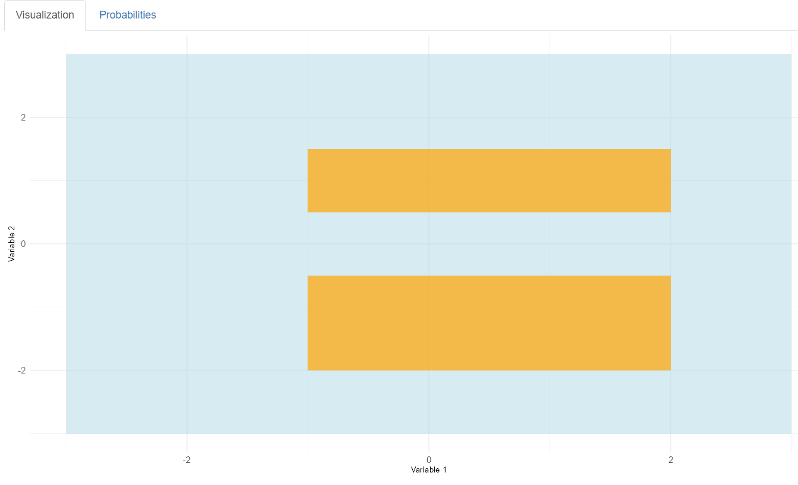


#### 2. **Normal Distribution**
   - **Inputs**:
     - **Mean (\(\mu\))**: The mean (center) of the normal distribution.
     - **Standard Deviation (\(\sigma\))**: The spread or dispersion of the distribution.
     - **Number of simulations**: How many samples to generate for empirical results.
     - **Interval**: The range of values for which to compute the probability.
   
   - **Outputs**:
     - **Probability Density Function (PDF)**: The bell-shaped curve of the normal distribution.
     - **Cumulative Distribution Function (CDF)**: The area under the curve up to a given value.
     - **Highlighted Interval**: The portion of the normal curve for which the probability is calculated.
     - **Simulation Histogram**: Comparison between theoretical and empirical results.

   **Visualization**:  
   _Normal distribution density curve and CDF with highlighted regions._ 
   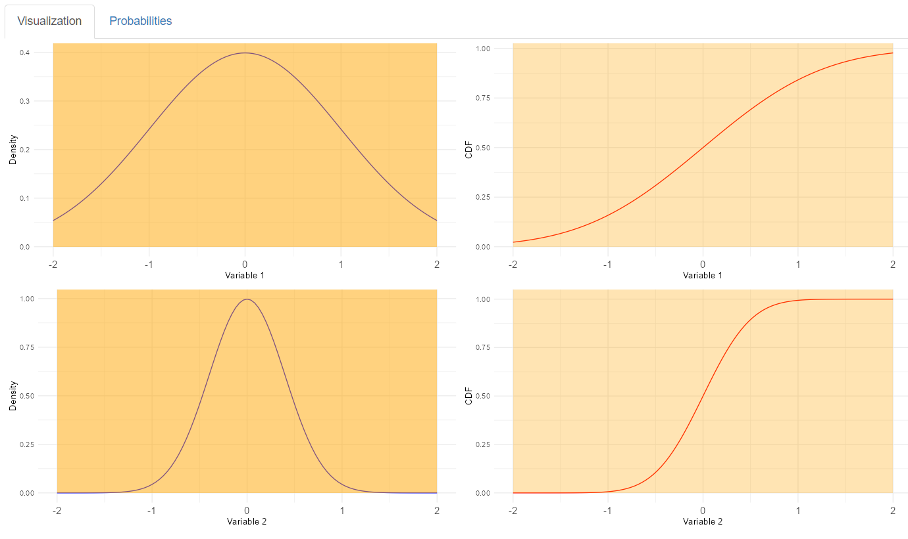 


#### 3. **Exponential Distribution**
   - **Inputs**:
     - **Rate (\(\lambda\))**: The rate parameter of the exponential distribution (inverse of the mean).
     - **Number of simulations**: How many samples to generate for empirical results.
     - **Interval**: The range of values for which to compute the probability.
   
   - **Outputs**:
     - **Probability Density Function (PDF)**: The exponential decay curve.
     - **Cumulative Distribution Function (CDF)**: The cumulative probability up to a given value.
     - **Highlighted Interval**: The portion of the exponential curve for which the probability is calculated.
     - **Simulation Histogram**: Comparison between theoretical and empirical results.

   **Visualization**:  
   _Exponential distribution with density and cumulative functions, showing highlighted intervals._ 
   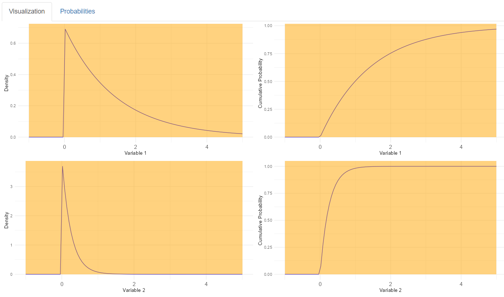


#### 4. **Binomial Distribution**
   - **Inputs**:
     - **Number of Trials (n)**: The number of independent trials (e.g., number of coin flips).
     - **Probability of Success (p)**: The probability of success on each trial (e.g., the probability of getting heads in a coin flip).
     - **Number of simulations**: How many samples to generate for empirical results.
     - **Interval**: The number of successes for which the probability is calculated.
   
   - **Outputs**:
     - **Probability Mass Function (PMF)**: The distribution of the number of successes in \(n\) trials.
     - **Cumulative Distribution Function (CDF)**: The cumulative probability of getting up to a certain number of successes.
     - **Highlighted Interval**: The portion of the binomial distribution for which the probability is calculated.
     - **Simulation Histogram**: Comparison between theoretical and empirical results.

   **Visualization**:  
   _Binomial distribution PMF and CDF with highlighted intervals, overlaid with simulation results._  
   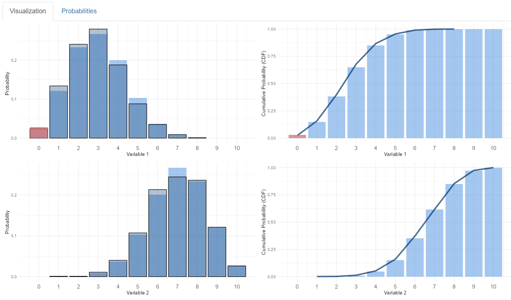


#### 5. **Geometric Distribution**
   - **Inputs**:
     - **Probability of Success (p)**: The probability of success on each trial.
     - **Number of simulations**: How many samples to generate for empirical results.
     - **Interval**: The number of trials for which the probability is calculated (e.g., the number of trials before the first success).
   
   - **Outputs**:
     - **Probability Mass Function (PMF)**: The distribution of the number of trials until the first success.
     - **Cumulative Distribution Function (CDF)**: The cumulative probability of getting a success by a certain trial.
     - **Highlighted Interval**: The portion of the geometric distribution for which the probability is calculated.
     - **Simulation Histogram**: Comparison between theoretical and empirical results.

   **Visualization**:  
   _Geometric distribution with probability mass and cumulative functions, showing highlighted intervals._  
   


---

### Additional Features

- **Simulation Validation**:
  - Compare theoretical probabilities with simulation results for empirical validation.
- **Dynamic Visualizations**:
  - Adjust visualizations interactively based on parameter changes.

#### Mathematical Equations

For each distribution, the app dynamically displays relevant formulas. For example:

1. **Normal Distribution**:
   - Probability density function (PDF):
     $$f(x) = \frac{1}{\sqrt{2 \pi \sigma^2}} e^{-\frac{(x - \mu)^2}{2 \sigma^2}}$$
   - Cumulative distribution function (CDF):
     $$F(x) = P(X \leq x) = \int_{-\infty}^x f(t) dt$$

2. **Exponential Distribution**:
   - PDF:  
     $$f(x; \lambda) = \lambda e^{-\lambda x}, \, x \geq 0$$
   - CDF:  
     $$F(x; \lambda) = 1 - e^{-\lambda x}$$

3. **Binomial Distribution**:
   - PMF:  
     $$P(X = k) = \binom{n}{k} p^k (1-p)^{n-k}$$
   - CDF:  
     $$P(X \leq k) = \sum_{i=0}^k P(X = i)$$

4. **Geometric Distribution**:
   - PMF:  
     $$P(X = k) = (1-p)^{k-1} p$$
   - CDF:  
     $$P(X \leq k) = 1 - (1-p)^k$$

---

This app provides a comprehensive exploration of distributions, empowering users to understand and visualize probabilities interactively.

---

## License

This project is licensed under the MIT License - see the LICENSE file for details.

## Contact

For any questions, feel free to contact me at sarthak.choudhary.21031@iitgoa.ac.in
